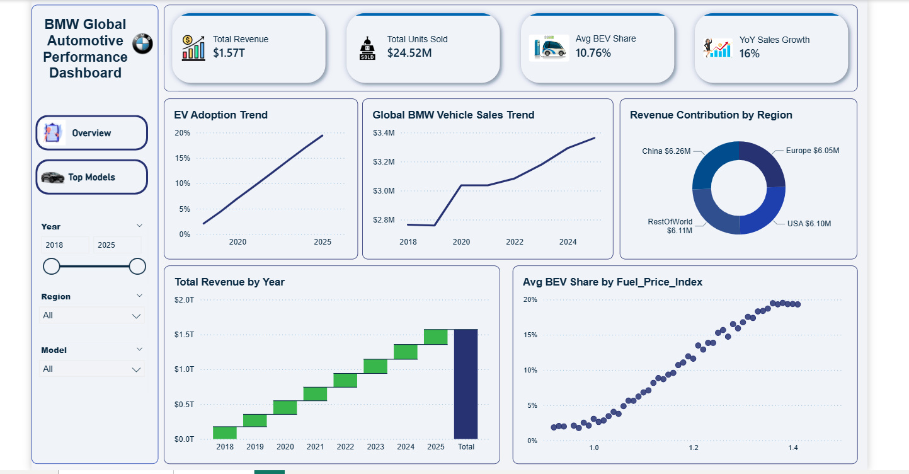
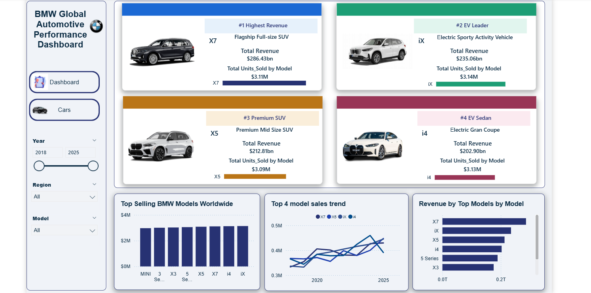
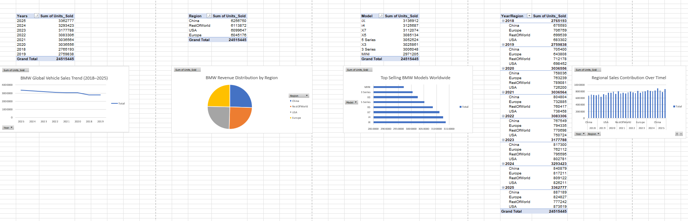
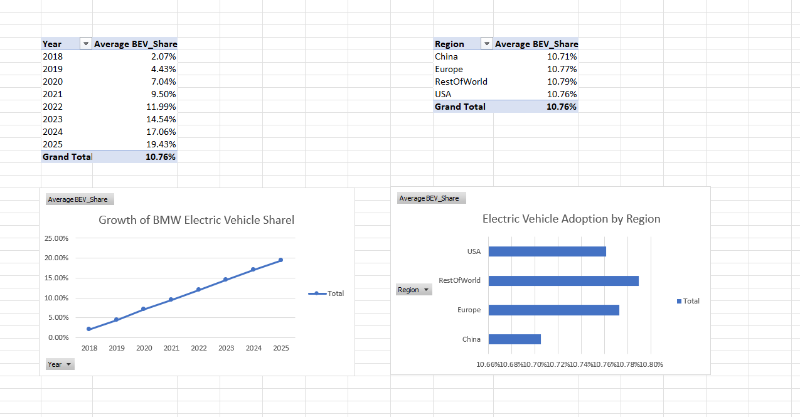
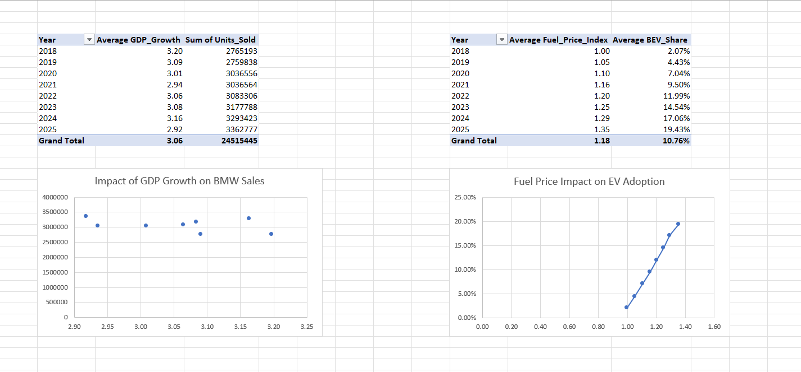
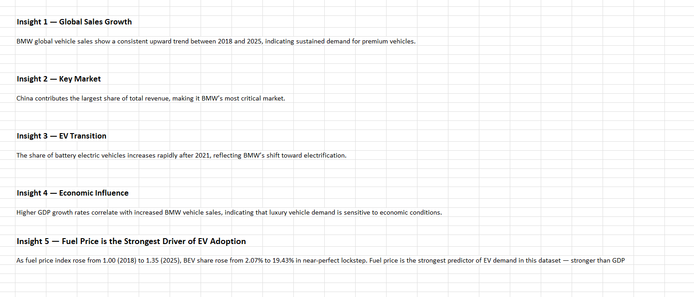
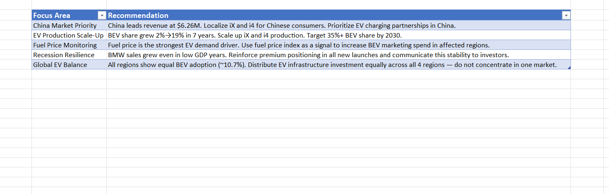

# 🚗 BMW Global Automotive Sales Analysis (2018–2025)


A complete end-to-end data analytics project analyzing BMW global vehicle sales across 4 regions and 8 models from 2018 to 2025. Raw Kaggle data was cleaned in Excel, analyzed across multiple sheets, and visualized in a 2-page interactive Power BI dashboard.

---

## 📊 Dashboard Preview

### Executive Overview


### Top Models


---

## 📋 Excel Analysis Preview

### Sales Analysis


### EV Analysis


### Economic Analysis


### Insights


### Recommendations


---

## 🎯 Business Context

BMW management wants to understand sales performance, regional demand, pricing impact, and EV adoption trends between 2018–2025 to support future market strategy and EV expansion decisions.

**Role:** Data Analyst
**Tools:** Microsoft Excel · Power BI Desktop · DAX

---

## 💡 Key Findings

| # | Insight | Finding |
|---|---------|---------|
| 1 | Global Sales Growth | Sales grew from 2.76M (2018) to 3.36M units (2025) — a **21.7% increase** |
| 2 | Top Revenue Region | **China leads** at $6.26M total revenue across 2018–2025 |
| 3 | EV Adoption | BEV share grew from **2.07% → 19.43%** — a 9.4x increase in 7 years |
| 4 | GDP Resilience | BMW sales grew even in low GDP years — **premium brand is recession-resilient** |
| 5 | Fuel Price Correlation | **Strongest finding:** fuel price and BEV share show near-perfect positive correlation |

---

## 📁 Project Structure

```
bmw-sales-analysis/
│
├── data/
│   ├── bmw_global_sales_raw.xlsx         ← Original raw Kaggle dataset
│   └── bmw_global_sales_clean.xlsx       ← Cleaned and formatted dataset
│
├── excel_analysis/
│   └── bmw_sales_analysis.xlsx           ← Full Excel workbook (6 sheets)
│
├── powerbi_dashboard/
│   └── bmw_dashboard.pbix                ← Power BI dashboard file
│
├── documentation/
│   ├── business_questions.md             ← 15+ business questions answered
│   ├── data_dictionary.md                ← Column definitions and data types
│   └── project_summary.md               ← Project overview and workflow
│
├── visuals/
│   ├── overview_page.png                 ← Executive Overview screenshot
│   ├── top_models_page.png               ← Top Models screenshot
│   ├── sales_analysis.png                ← Sales Analysis Excel sheet
│   ├── ev_analysis.png                   ← EV Analysis Excel sheet
│   ├── economic_analysis.png             ← Economic Analysis Excel sheet
│   ├── insights.png                      ← Insights Excel sheet
│   └── recommendations.png              ← Recommendations Excel sheet
│
└── README.md
```

---

## 📑 Excel Workbook — Sheet Guide

| Sheet | Contents |
|-------|----------|
| `Clean Data` | 3,000+ rows · 11 columns · cleaned and verified |
| `Sales_Analysis` | Sales by Year, Region, Model, Year×Region — 4 pivot tables + 4 charts |
| `EV_Analysis` | BEV share by year and region — 2 pivot tables + 2 charts |
| `Economic_Analysis` | GDP vs Sales scatter · Fuel Price vs BEV Share scatter |
| `Insights` | 5 key business findings with data-backed numbers |
| `Recommendations` | 5 strategic actions for BMW management |

---

## 📈 Power BI Dashboard — Page Guide

**Page 1 — Executive Overview**
- 4 KPI cards: Total Revenue · Total Units Sold · Avg BEV Share · YoY Sales Growth
- EV Adoption Trend (line chart)
- Global BMW Vehicle Sales Trend (line chart)
- Revenue Contribution by Region (donut chart)
- Total Revenue by Year (waterfall chart)
- Avg BEV Share by Fuel Price Index (scatter chart)
- Filters: Year slicer · Region · Model

**Page 2 — Top Models**
- Top 4 model cards by revenue: X7 · iX · X5 · i4 (image + revenue + units sold)
- Top Selling BMW Models Worldwide (bar chart)
- Top 4 Model Sales Trend 2018–2025 (line chart)
- Revenue by Model (bar chart)

---

## 🗂️ Dataset Columns

| Column | Type | Description |
|--------|------|-------------|
| `Year` | Integer | Sales year (2018–2025) |
| `Month` | Integer | Month number (1–12) |
| `Region` | Text | Europe · China · USA · RestOfWorld |
| `Model` | Text | 3 Series · 5 Series · X3 · X5 · X7 · i4 · iX · MINI |
| `Units_Sold` | Integer | Number of vehicles sold |
| `Avg_Price_EUR` | Decimal | Average selling price in Euros |
| `Revenue_EUR` | Decimal | Units_Sold × Avg_Price_EUR |
| `BEV_Share` | Percentage | Share of battery electric vehicle sales |
| `Premium_Share` | Percentage | Share of premium segment sales |
| `GDP_Growth` | Decimal | Regional GDP growth rate |
| `Fuel_Price_Index` | Decimal | Fuel price index (base: 1.00 in 2018) |

---

## ✅ Strategic Recommendations

| Focus Area | Recommendation |
|------------|----------------|
| China Market Priority | China leads revenue at $6.26M. Localise iX and i4 for Chinese consumers. Prioritise EV charging partnerships in China. |
| EV Production Scale-Up | BEV share grew 2%→19% in 7 years. Scale up iX and i4 production. Target 35%+ BEV share by 2030. |
| Fuel Price Monitoring | Fuel price is the strongest EV demand driver. Use fuel price index as a signal to increase BEV marketing spend in affected regions. |
| Recession Resilience | BMW sales grew even in low GDP years. Reinforce premium positioning in all new launches and communicate this stability to investors. |
| Global EV Balance | All regions show equal BEV adoption (~10.7%). Distribute EV infrastructure investment equally across all 4 regions. |

---

## 🚀 How to Open

**Excel file:** Open with Microsoft Excel 2016 or later.

**Power BI file:** Download [Power BI Desktop](https://powerbi.microsoft.com/desktop/) (free) → File → Open → select `bmw_dashboard.pbix`

---

*Data Source: Kaggle — BMW Global Sales Dataset · Period: 2018–2025 · Tools: Microsoft Excel, Power BI Desktop*
